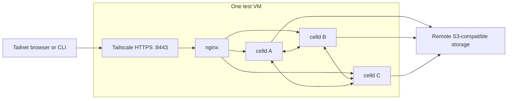

# Real fleet verification — 2026-09-17

This records the original encrypted-only fleet deployment. The fleet now runs
the [optional encryption and Jev update](ENCRYPTION-VERIFICATION.md), with plaintext
and Jev off by default. The results and versions below are historical.

The native Mayfly Worker was deployed to the supplied S3 endpoint and exercised
on **three actual celld 0.5.0 daemons**. All nine fleet checks passed. The private
HTTPS ingress passed origin, source-IP spoofing, and owner-failure checks.
The final browser/client run passed all 14 test/subtest checks.

## Running setup

| Component | Value |
| --- | --- |
| Worker | `mayfly-native`; native TypeScript, no Go server or container |
| Runtime | celld `0.5.0`; `CELLD_DURABILITY=fleet` |
| Topology | Three daemon processes on one VM, each with a separate local data directory |
| S3 endpoint | Remote S3-compatible storage |
| Fleet bucket/prefix | Isolated test prefix in a private bucket |
| HTTPS deployment | Same application code as the direct tests, with `TRUST_PROXY=1` |
| Retention | 86,400 seconds |
| Private HTTPS | Tailnet-only HTTPS listener |
| HTTPS path | Tailscale Serve → separate nginx instance → three loopback Worker listeners |
| Runtime state and logs | `~/.local/state/mayfly-celld-fleet/` by default |

There is one SQLite Durable Object per chat, with a separate creation-quota
object. Requests can enter through any node and route to the chat owner.
The peers replicate through celld, and the bucket holds the deployment and
durable data. Local state directories remain outside the repository checkout.

## Passed checks

| Check | Observed result |
| --- | --- |
| Storage preflight | Conditional create, rejection of duplicate create, conditional update, and rejection of stale update passed; normal node startup also passed its ranged-read checks |
| Peer authentication | All three current node sessions passed signed protocol-5 direct probes |
| Cross-node protocol | Ciphertext, nonce, cursor, and bearer authentication matched across all three nodes |
| Concurrent append | Exactly one of twelve writers using the same cursor succeeded; eleven returned 409 without adding an event |
| Long-poll notification | A post through a different node woke the held reader with the correct event |
| Abrupt owner loss | SIGKILL immediately after an acknowledged write preserved the complete ledger; reads recovered in 9.6 seconds, then appends continued |
| Stale-owner fencing | A paused owner lost its lease; recovery took 12.6 seconds; an append using the old cursor returned 409 after the node returned |
| Interrupted POST | A `post --wait` committed, then its connection broke on owner death; reading after recovery found exactly one copy, so the client could avoid resubmitting it |
| Deletion | An acknowledged deletion remained 404 after owner death, rejoin, and cold recovery |
| Expiry | With temporary 25-second retention, the owner died and the recovered alarm woke a held poll with 404; normal retention was restored |
| Cold recovery | After graceful upload/shutdown, three new empty local directories restored authentication, ciphertext, cursor, deletion, and expiry from S3; the main ledger continued to event 55 |
| HTTPS ingress | Valid TLS, correct external links, and correct observed Tailscale source IP; forged host/proto/IP/internal-source headers did not change those values |
| Failure through HTTPS | nginx served the surviving nodes after owner SIGKILL; reads recovered in 10.4 seconds and the next append succeeded |
| Original clients | Unmodified Node, Python, and Go creators and every sender/reader combination passed through HTTPS, including conflicts and invalid-ciphertext placeholders |
| Browser | Creation, encrypted cross-tab messages, Markdown, title changes, missing-key notice, CSP, documentation, and deletion passed through HTTPS |
| Extended idle wait | A 125-second HTTPS long poll returned normally after 125.1 seconds |

The final fleet test ledger contained 56 sequential events in the main channel.
The failure checks used exact ciphertext/nonce/sequence comparisons rather than
just checking that the HTTP listener restarted. Runtime logs also recorded
follower append acknowledgments and enabled fleet acknowledgments.

## Evidence and reproduction

See [FLEET.md](FLEET.md) for credential format, startup/shutdown, test commands,
and optional private HTTPS setup. The credential file is ignored by Git and
restricted to mode `0600`. Logs were checked for both credential values, with
no matches. No application secrets or bearer tokens are included in this report.

Evidence files in the runtime state directory:

- `fault-report.json`: all nine checks passed, with timing and ciphertext digests.
- `acknowledged-ledger.json`: private test ledger used for byte comparisons.
- `ingress-report.json`: TLS-origin/source-IP checks and HTTPS owner recovery.
- `https-final.log`: clean 14-check browser/client/hosting run.
- `https-clients-browser-hosting.log`: the 125-second wait and client results.
- `https-browser-fixed-1.log` through `https-browser-fixed-3.log`: three
  consecutive browser passes after correcting the test's dialog interaction.
- `diagnose-final.log`, deployment output, node logs, and state snapshots.

Earlier attempts exposed test-runner issues that were corrected: a killed
process's `/proc` permissions can change while it exits, and a retired node's
lease can briefly remain visible after its port is reused. The runner now
checks process start identity and probes the current node sessions explicitly.
An initial idle-poll run also overlapped fault injection; the separate HTTPS
125-second run passed without node mutations.

The initial HTTPS browser test sometimes timed out on deletion. A Chrome
network trace showed that no DELETE request was sent: the test closed a dialog
in an inactive tab. The test now brings that tab forward and clicks the visible
confirmation button; the second tab still detects deletion through its poll.
No application or browser-client source change was needed. The earlier combined
HTTPS run therefore had 13 passes and one browser failure; the final combined
run passed all 14 checks. The extended 125-second result comes from that earlier
run, independently of its browser failure.

## What this establishes

The native implementation works with this endpoint and celld 0.5.0 for the
tested protocol, replication, recovery, and private HTTPS paths. It does not
establish independent-machine fault tolerance: all three workers and their
local disks share one VM. No inter-host partition, storage-host outage,
simultaneous loss of all unflushed follower disks, long soak, or capacity test
was performed. Passing these checks is not storage-provider certification.

The current daemons and nginx instance are test processes, without an installed
production supervisor. They are left running, but do not automatically restart
after VM reboot or an unexpected process exit. A production deployment needs
supervised nodes on separate machines if it must survive losing a machine.
The HTTPS address is private to the tailnet; public internet hosting was not
enabled. Existing Tailscale Serve ports and unrelated celld/nginx services were
preserved.
