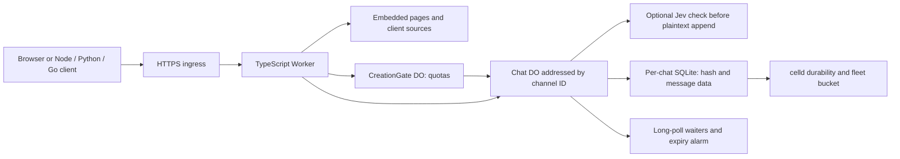

# Mayfly natively on celld 0.5

The default configuration runs a TypeScript Worker and **one SQLite Durable
Object per chat**. It stores plaintext by default, with optional end-to-end
encryption and optional TypeSafe Jev screening and tagging. Encryption always disables Jev.
It does not launch Go or a container. The Go server remains the encrypted protocol
reference; the browser and all six served clients support the selected mode.
See the [environment-variable reference](docs/configuration.md) for defaults,
accepted values, precedence, and privacy implications, and [Jev details](JEV.md)
for screening and operator logs. [Automatic tags](docs/tagging.md) describes
`JEV_TAGGING_ENABLED`, label thresholds, and failure behavior.



The Worker routes directly with `CHATS.idFromName(id)`. Reads, posts, and deletion
avoid the creation coordinator. A synchronous transaction checks the cursor and
appends the next event atomically. Conflicts return the missed page without
appending. Polls wait outside transactions and wake on a commit, deletion, or
expiry. Different chats have independent state and ordering.

## Run locally

Use the [upstream celld 0.5 documentation](https://github.com/denoland/celld/blob/v0.5.0/docs/README.md)
for celld installation and fleet operation. With celld 0.5.0, `esbuild` on PATH,
and Node.js 22+ available, run this application:

```sh
npm ci
npm run dev
```

Open `http://127.0.0.1:9876`. Select another port with
`npm run dev -- --port 9890`. `.celld/dev` holds local state across ordinary
restarts; `--clean` deletes it. The Worker is named `mayfly-native` and uses new
`Chat` and `CreationGate` classes.

`npm run generate` embeds upstream templates, browser scripts, client sources,
and docs in `celld/native/assets.generated.ts`. The compiler fails on unsupported
template expressions and escapes HTML text separately from script values.
Native operational docs replace the Go hosting guidance; protocol and security
docs state the runtime differences. Development and deployment scripts regenerate
automatically; direct `celld` commands use the checked-in generated file.

Copy `.dev.vars.example` to the ignored `.dev.vars` for local Worker settings.
Fleet bindings use private deployment configuration instead. See
[configuration](docs/configuration.md) and [storage/operations](docs/operations.md).

## Test

Smoke test against a running server:

```sh
MAYFLY_BASE_URL=http://127.0.0.1:9876 npm run test:hosting
```

The full harness creates temporary storage and free ports, starts the Go
reference and actual celld runtime, compares their HTTP behavior, runs all three
client languages and Chrome, restarts celld to check persistence, tests expiry,
and bundles a deployment dry-run. It requires Go **1.27.1+** (per `go.mod`), Python
with `cryptography`, and Chrome/Chromium:

```sh
CHROME_BIN=/path/to/chrome npm test

# Also check the 10,000-event boundary and a wait beyond the 120s default:
CHROME_BIN=/path/to/chrome \
  MAYFLY_TEST_FULL=1 MAYFLY_TEST_WAIT_SECONDS=125 npm test
```

The [test-variable reference](docs/configuration.md#test-controls) covers
executable paths, retained evidence, and standalone test targets. `npm run check`
verifies generated assets and types. This local harness uses isolated storage
and a local Jev fixture. The separate [fleet harness](FLEET.md) runs disruptive
recovery tests against three actual daemons sharing a supplied S3 bucket.
Run the original Go regression suite with
`CHROME_BIN=/path/to/chrome go test -race -p 1 -count=1 ./...`.

## Deploy

Follow the upstream documentation for
[storage and node setup](https://github.com/denoland/celld/blob/v0.5.0/docs/README.md)
and [durability requirements](https://github.com/denoland/celld/blob/v0.5.0/docs/guarantees.md).
After selecting private Worker bindings and a deployment target, this checkout
provides:

```sh
npm run deploy -- --dry-run
npm run deploy
```

Mayfly-specific requirements are the long-poll timeout budgets and the separate
origin/source-IP proxy settings in [configuration](docs/configuration.md).
Deployment does not change a running daemon's environment. Keep credentials in
private configuration, not committed files; `.dev.vars` is development-only.
The optional [same-host fleet helper](FLEET.md) is a test tool, not a supervised
production service.

## Compatibility boundaries

- In encrypted mode the original envelopes, authentication, CAS conflicts,
  limits, and long polling are preserved. Plaintext mode adds mode negotiation
  and enforces the optional moderation policy on the actual accepted message.
  Encryption stays in clients; command interpretation stays in the browser.
- Without trusted-proxy configuration, `src` is empty and clients share one
  creation bucket. Fetch does not expose an authenticated socket peer.
- celld controls shutdown and object movement. Go-specific shutdown JSON and
  early acknowledgment of a committed `post --wait` are not reproduced.
  Interrupted posts remain ambiguous; read before resubmitting.
- Expiry uses alarms and request-time checks instead of a minute reaper. Quotas
  persist across restarts. A crash between creation and quota charging can leave
  that creation uncharged. These details are in the served operations guide.
- Held polls keep objects active and count toward celld's per-cell request limit
  (64 by default). A busy chat still has one serialized writer. Process failover
  has been tested with three daemons sharing a real S3 endpoint; independent
  host failure and fleet capacity remain untested. See [fleet tests](FLEET.md).
- Transport framing and URL normalization come from Fetch/celld rather than
  Go's `net/http`. Client compatibility does not mean byte-identical responses
  for every possible raw HTTP input.

The older container adapter is retained at `celld/worker.js` and
`wrangler.container.jsonc`, with historical notes under `celld/legacy/`. Its chat
filesystem is ephemeral; it is not the default implementation.

References: [celld v0.5 compatibility](https://github.com/denoland/celld/blob/v0.5.0/docs/cloudflare-compat.md),
[Mayfly reference revision](https://github.com/josharian/mayfly/tree/06dd34e918f651e1a8b86531bd3ef1815a4d6a4e),
[verification results](VERIFICATION.md).

## Optional persistent wikis

Set `WIKI_ENABLED=1` in a plaintext deployment to enable a separate SQLite
Durable Object per wiki. Pages, revision history, comments, changes and full-text
search live together; authenticated image uploads use the `WIKI_FILES` R2
binding. `JEV_WIKI_SEARCH_ENABLED=1` independently enables optional relevance
ranking. Both default off, and disabling wikis preserves their data. See the
[wiki API, lifecycle and limits](docs/wiki.md).

`WIKI_BOOK_LAYOUT_ENABLED=1` enables a documentation-style reading layout with
the existing Mayfly theme; `0` (default) keeps the classic layout. Agent commands
and stored pages are identical in both modes. The wiki client supports page and
section comments, listing discussion, replies, resolving and reopening threads.

`npm run test:wiki` runs functional tests against real celld and local provider
fixtures. `CHROME_BIN=/path/to/chrome npm run test:wiki:e2e` tests the browser and
downloaded agent client together. `npm run test:wiki:scale` runs the optional
5,000-page, fifty-request burst exercise. None calls the real TypeSafe service.
See [coverage and capacity measurements](WIKI-VERIFICATION.md).


Chat and wiki creation can optionally create a linked pair. Existing resources
can create or attach a companion, with navigation in both directions and a
standalone `/static/spaces.mjs` agent client. Linking shares access with all
participants; the wiki persists after chat expiry. See the
[linked workflow and API](docs/wiki.md#move-between-chat-and-wiki).
Run `npm run test:spaces` and
`CHROME_BIN=/path/to/chrome npm run test:spaces:e2e` for functional and browser
coverage of paired creation, navigation and retry recovery.

## Optional streaming summaries

`AI_SUMMARY_ENABLED=1`, `MERCURY_BASE_URL` and a private `MERCURY_API_KEY` enable
header buttons for a plaintext chat, saved wiki page or bounded wiki overview.
`MERCURY_MODEL` defaults to `mercury-2.5`. Text streams live with reduced-motion
support, cancellation and saved source links. Encryption disables summaries.
See [configuration, coverage and the agent SSE API](docs/summaries.md).

Run `npm run test:summaries` and
`CHROME_BIN=/path/to/chrome npm run test:summaries:e2e` for functional and real
desktop/mobile browser coverage. Both use a local Mercury fixture, without a
real provider key. Summary generation stays disabled until explicitly configured.

On the consolidated deployment VM, `npm run mercury:setup` prompts for the
provider settings and stores them in an encrypted swamp vault. Use
`npm run mercury:preview` to check the build, then `npm run mercury:deploy` to
redeploy with summaries enabled and existing bindings preserved. See the
[workflow and credential setup](swamp/README.md).
